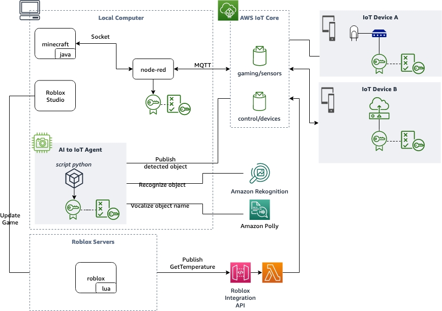

# Playground4AWS

Projects for AI/ML and IoT integration for games and other presented at re:Invent 2021.

## Architecture

 

## Minecraft and Lamps

This project is a Minecraft Modding using [Forge](https://files.minecraftforge.net/net/minecraftforge/forge/) platform, [Node-Red](https://nodered.org/), [IoT device with ESP32](https://iot-esp32.workshop.aws/en/module1.html) and [AWS IoT Core](https://console.aws.amazon.com/iot/home) to manage messages, security and device fleet. With this Minecraft Mod you can turn on and off a lamp (or any other thing!) breaking blocks; once you break a block a TCP connection between Minecraft and Node-RED will be stabilished and Node-RED will communicate with AWS IoT Core using MQTT protocol. 

We choose to use Node-RED instead of adding the AWS IoT Core API inside Minecraft to avoid issues with the complex classloading system from Minecraft Forge and also because it's easy, simple and fun to use Node-RED as a gaming gateway to IoT devices.

To replicate this tutorial you will need:

1. [Install Java Development Kit](https://docs.aws.amazon.com/pt_br/corretto/latest/corretto-11-ug/downloads-list.html)
2. [Install Node-RED](https://nodered.org/docs/getting-started/local)
3. [Clone the github project](https://github.com/vsenger/Playground4AWS)
4. [Configure AWS IoT Core](https://console.aws.amazon.com/iot/home)
5. Configure Node-RED

Follow [this tutorial](https://github.com/vsenger/Playground4AWS/tree/main/minecraft) to replicate this demo.

Check the running demo here:

## IoT Device with ESP32

We are using two different devices to provide sensors and control relay / lamp:

1. [Playground4IoT](https://github.com/vsenger/Playground4IoT): this is an open-source hardware project developed in Brazil that you can replicate, produce, use or sell it! This device uses an ESP32 module and has LCD display, accelerometer, temperature, humidity, light sensors, connectors for 200+ different sensors, connector for solar panel and battery recharger circuit.

  

2. ESP32 Do it your self device: this version is very simple to build it your self and it has an ESP32 module, temperature and humidity, relay board and some wires. You can follow this complete Let's Build tutorial to replicate the project:

 - [Let's Build #1: Introduction to ESP32](https://awsomedayonline2021.s3.eu-west-1.amazonaws.com/s+Build+Series_Episode+5_Module+1_Vincius%2BAna.mp4)
 - [Let's Build #2: Building your first IoT App](https://awsomedayonline2021.s3.eu-west-1.amazonaws.com/s+Build+Series_Episode+5_Module+2_Ana+Cunha.mp4)
 - [Let's Build #3: Monitoring temperature and humidity with ESP32](https://awsomedayonline2021.s3.eu-west-1.amazonaws.com/s+Build+Series_Episode+5_Module+3_Vincius+Senger.mp4)

## AI2IoT Agent

This agent is a Python3 script that uses Amazon Rekognition and your computer's camera to recognize objects and send IoT messages to AWS IoT Core. This agent is very simple to run and you can use it for multiple projects: you can recognize helmet, mask, glasses, hat, count people and much more.

Follow [this tutorial](https://github.com/vsenger/Playground4AWS/tree/main/ai-agent) do build and run the AI2IoT Agent.

  

## Roblox Integration with AI2IoT Agent and IoT sensors

