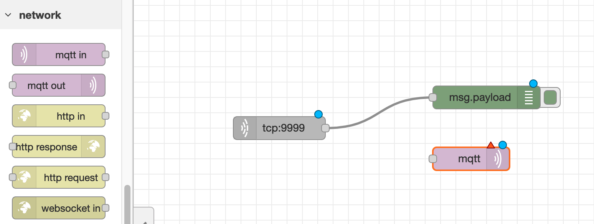

# Playground4AWS

Projects for AI/ML and IoT integration for games and other presented at re:Invent 2021.

## Minecraft and Lamps

 

This project is a Minecraft Modding using [Forge](https://files.minecraftforge.net/net/minecraftforge/forge/) platform, [Node-Red](https://nodered.org/), [IoT device with ESP32](https://iot-esp32.workshop.aws/en/module1.html) and [AWS IoT Core](https://console.aws.amazon.com/iot/home) to manage messages, security and device fleet. With this Minecraft Modding you can turn on and off a lamp (or any other thing!) breaking blocks; once you break a block a TCP connection between Minecraft and Node-RED will be stabilished and Node-RED will communicate with AWS IoT Core using MQTT protocol. 

We choose to use Node-RED instead of adding the AWS IoT Core API inside Minecraft to avoid issues with the complex classloading system from Minecraft Forge and also because it's easy, simple and fun to use Node-RED as a gaming gateway to IoT devices.

## Running Demo Video

## Tutorial

To replicate this tutorial you will need:

### 1. Install Java Development Kit
You can download and install Amazon Corretto JDK which is free and open-source following this link [Install Java Development Kit](https://docs.aws.amazon.com/pt_br/corretto/latest/corretto-11-ug/downloads-list.html)

### 2. Install Node-RED
Node-RED is a NodeJS tool to create IoT flows with very low-coding development environment. Follow this link to install it - [Install Node-RED](https://nodered.org/docs/getting-started/local)

### 3. Configure AWS IoT Core

#### Open [AWS IoT Core Console](https://console.aws.amazon.com/iot/home)
#### Click Manage - Things - Create Things - Create Single Thing
 

#### Click Create Single Thing
 

#### Name it as gaming_device with default values for other configurations and click next
 

#### Configure Device Certificate - Auto-generate a new certificate
 

#### Create a policy with action iot:* -> Effect Allow and attach it to your thing
 

#### Download certificate, public key, private key and root CA and store in a folder - we will need the keys to integrate with Node-RED and also for AI / ML Agent.
 

#### Attach the created policy to your thing
 

#### Done! Now you have created a thing to represent your device and has the certificates stored in a well know folder
 

### 4. Configure Node-RED

Open your browser and type http://localhost:1880 

#### Add a TCP In Node
 

#### Configure TCP In to list port number 9999
 

#### Add a Debug node
 

#### Connect TCP node to Debug node
 

#### Add MQTT Out node
 

#### Connect MQTT Out node to TCP In
 

#### Double-click MQTT node to configure your connection
 

#### We need to add our AWS IoT Core endpoint as server
 

#### Visit your AWS IoT Core console, click Settings and copy the Device Data endpoint link
 

#### Configure certificate, private key and Root CA that we created and downloaded during the AWS IoT Core setup
 

#### Configure the topic your IoT device will be listening
 

#### Done! Now click Deploy on Node-RED and you will see your MQTT node connected to AWS IoT Core
 

### 5. Clone our git repository and run the Minecraft

#### Open a command-line terminal and type git clone https://github.com/vsenger/Playground4AWS
 

#### Type cd Playground4AWS/minecraft

#### Type chmod 755 gradlew

#### Type ./gradlew runClient
 

#### Now you can create a new world and start breaking blocks. You will see the message in your Node-RED debug console or you can use AWS IoT Core Console -> Test and subscribe to your MQTT Topic to see the message arring at AWS Cloud. In my case a have a lamp here that listens to control/lamp and turn it on if is 1 and off when is 0

#### Java Code

You can open the class file ExampleMod.java 
 

The code is very simple but with the same arctechiture you can control anything from Minecraft or start using sensors to feed and change your world!

 
